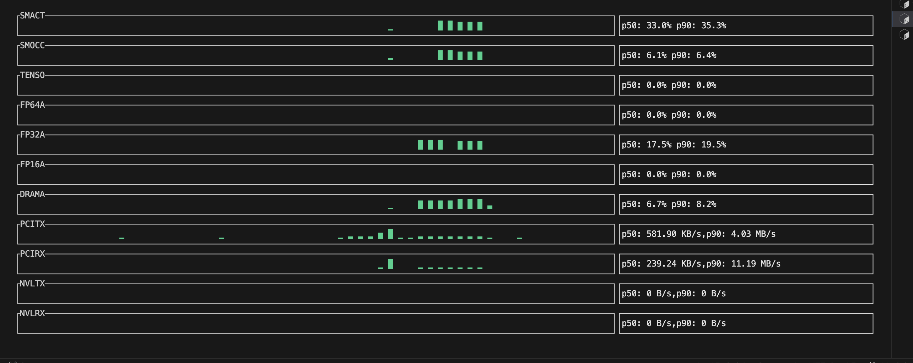

# DCMGI-tui

A quick terminal UI for monitoring NVIDIA GPU metrics using `dcgmi dmon`.  Goal was to visualize the DCGMI without going through grafana. This was a quick script generated by llm.



Displays metrics like SM utilization, FP32/FP16 activity, DRAM, PCIe, and NVLink bandwidth.
```
cargo run --release -- --interval 100 --log out.csv
```
Interval is in Ms

## Current Metrics recorded
```
DCGMI 1002,1003,1004,1006,1007,1008,1005,1009,1010,1011,1012
```
| Field ID | Metric Name     | Description                                               |
|----------|------------------|-----------------------------------------------------------|
| 1002     | SMACT            | SM (Streaming Multiprocessor) active ratio               |
| 1003     | SMOCC            | SM occupancy ratio (how fully packed the warps are)      |
| 1004     | TENSO            | Tensor core activity (HMMA utilization)                  |
| 1005     | DRAMA            | DRAM interface active ratio                              |
| 1006     | FP64A            | FP64 pipeline activity                                    |
| 1007     | FP32A            | FP32 pipeline activity                                    |
| 1008     | FP16A            | FP16 pipeline activity                                    |
| 1009     | PCITX            | PCIe transmit bytes (per interval)                       |
| 1010     | PCIRX            | PCIe receive bytes (per interval)                        |
| 1011     | NVLTX            | NVLink transmit bytes (per interval)                     |
| 1012     | NVLRX            | NVLink receive bytes (per interval)                      |